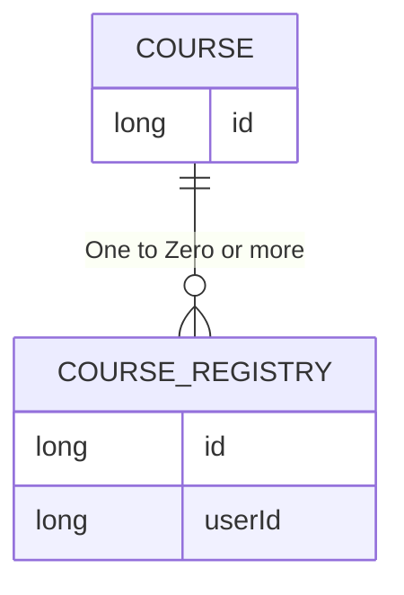

# 요구사항 명세

| 번호 | 유형  | 이름          | 내용                                           | 여부 |
|----|-----|-------------|----------------------------------------------|----|
| 1  | 기능  | 특강 신청       | 선착순 30명 이내로 신청한 경우 특강을 신청할 수 있다.             | O  |
| 2  | 기능  | 특강 신청 실패    | 선착순 30명 밖인 경우 특강 신청 요청이 실패한다.                
| 3  | 기능  | 특강 신청 내역 조회 | 특강 신청 내역과 완료 여부를 조회할 수 있다.                   |    |
| 4  | 비기능 | 동시성 처리      | 멀티 어플리케이션 환경에서 동시성을 처리하도록 데이터베이스 트랜잭션을 관리한다. |    |

# ERD 설계

